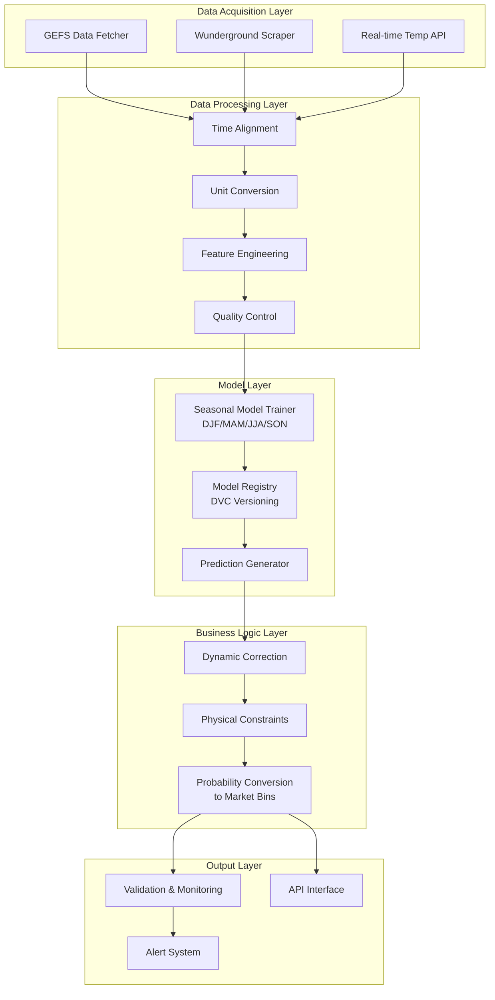

# System Architecture

## Overview

The Polymarket Temperature Prediction System is organized into modular components with clear interfaces. The system follows a pipeline architecture where data flows through sequential processing stages.

## Module Architecture

## Module Details

### 1. Data Acquisition Module
**Purpose**: Fetch raw data from various sources
**Components**:
- `gefs_fetcher.py`: Download GEFS forecast data (historical and real-time)
- `wunderground_scraper.py`: Extract historical observations from Wunderground
- `realtime_temp.py`: Get current temperature observations
- `data_monitor.py`: Monitor data availability and freshness

**Input/Output**:
- Input: Configuration (stations, time ranges)
- Output: Raw data files (GRIB2, JSON, CSV)

### 2. Data Processing Module
**Purpose**: Clean, align, and prepare data for modeling
**Components**:
- `time_aligner.py`: Convert all times to station local time, align forecast/observation windows
- `unit_converter.py`: Standardize temperature units to Celsius
- `feature_extractor.py`: Extract features from GEFS ensemble forecasts
- `quality_control.py`: Detect and handle missing/erroneous data

**Key Algorithms**:
- Bilinear interpolation for spatial data
- Elevation correction using standard lapse rate
- Daily max/min extraction from time series

### 3. Model Training Module
**Purpose**: Train and maintain seasonal prediction models
**Components**:
- `seasonal_trainer.py`: Train separate models for DJF/MAM/JJA/SON buckets
- `hyperparameter_tuner.py`: Optimize model parameters
- `model_validator.py`: Compute validation metrics (CRPS, PIT, Talagrand)
- `model_registry.py`: Version control using DVC

**Training Strategy**:
- Quarterly retraining with 5-year rolling window
- Separate models for max and min temperatures
- Skewed Gaussian distribution parameter estimation

### 4. Prediction Generation Module
**Purpose**: Generate real-time probability predictions
**Components**:
- `predictor.py`: Load appropriate seasonal model, generate base predictions
- `dynamic_corrector.py`: Apply conditional probability truncation based on current temperature
- `constraint_enforcer.py`: Apply physical constraints (max warming/cooling rates)
- `bin_converter.py`: Convert continuous distributions to Polymarket bin probabilities

**Real-time Logic**:
- Event-driven: Trigger on new GEFS data arrival
- Hourly updates: Recompute dynamic correction with latest temperature
- Fallback strategies for delayed/missing data

### 5. Validation & Monitoring Module
**Purpose**: Monitor system performance and data quality
**Components**:
- `metrics_calculator.py`: Compute CRPS, PIT, Talagrand diagrams
- `alert_manager.py`: Trigger alerts on performance degradation
- `dashboard_generator.py**: Create visualization dashboards
- `report_generator.py`: Generate periodic performance reports

**Monitoring Strategy**:
- Sliding window metrics (30-day)
- Comparison against naive benchmarks
- Data freshness monitoring

### 6. API Interface Module
**Purpose**: Provide predictions to downstream systems
**Components**:
- `prediction_api.py`: REST API for prediction requests
- `market_adapter.py`: Format predictions for Polymarket integration
- `cache_manager.py`: Cache frequently accessed predictions
- `rate_limiter.py`: Manage request load

## Data Storage Strategy

### Storage Types
1. **Raw Data**: File system (GRIB2, JSON, CSV)
2. **Processed Features**: Parquet format (columnar storage)
3. **Model Parameters**: Pickle/Joblib files (versioned with DVC)
4. **Predictions & Metrics**: SQLite database
5. **Configuration**: YAML/JSON files

### Retention Policy
- Raw data: 1 year
- Processed features: 2 years  
- Predictions: Permanent
- Models: Keep last 4 versions (1 year)

## Deployment Architecture

### Scheduling
- **Primary trigger**: New GEFS data arrival (every 6 hours)
- **Secondary trigger**: Hourly temperature updates
- **Fallback**: Use previous forecast if delay > 3 hours

### Fault Tolerance
- **Level 1**: Use slightly stale data (< 6 hours old)
- **Level 2**: Use simplified model (GEFS mean only)
- **Level 3**: Use climatological averages
- **Level 4**: Return null with degradation flag

### Version Management
- Shadow testing of new models before production deployment
- Automatic rollback if new model underperforms
- Comprehensive version metadata (training date, data range, hyperparameters, performance)

## Interfaces

### External Interfaces
1. **GEFS Data Source**: AWS Open Data (Herbie library)
2. **Wunderground**: Web scraping (requests + BeautifulSoup)
3. **Real-time Temperature**: METAR or weather API
4. **Polymarket Integration**: REST API for market data

### Internal Interfaces
1. **Configuration**: YAML files for stations, models, thresholds
2. **Logging**: Structured JSON logs for monitoring
3. **Metrics**: Prometheus metrics for operational monitoring
4. **Alerts**: Slack/Email notifications for critical issues